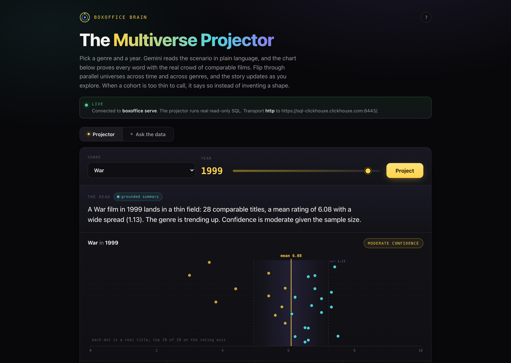
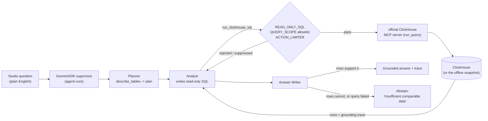

# BoxOffice Brain

A cinema-catalogue analytics agent. Ask it a question in plain English and it
writes read-only ClickHouse SQL, runs it through **ClickHouse's own MCP server**,
and answers with the numbers that actually came back, or tells you it cannot.

```
$ BOX_TRANSPORT=mcp boxoffice ask "which genres underperformed in 1999 vs 1998?" --no-llm

Genres whose mean rating fell from 1998 to 1999 (12 of 18 genres with enough titles):
  War: mean rating 6.08 in 1999 vs 6.86 in 1998 (delta -0.78, 28 vs 24 rated titles)
  Short: mean rating 6.19 in 1999 vs 6.67 in 1998 (delta -0.48, 441 vs 327 rated titles)
  Musical: mean rating 5.80 in 1999 vs 6.26 in 1998 (delta -0.46, 26 vs 20 rated titles)
Worst: War.
Lowest-rated War titles of 1999: Active Stealth (3.00); Storm Catcher (3.60);
Cetverored (3.80). These titles sit inside the genre and year named above; that
is an association within the same cohort, not a demonstrated cause.

-- clickhouse_mcp: elapsed_ms=925.3
-- 2 query trace(s) | abstained=False | error=None | transport=mcp | guardrails=6
```

Built for the **Agentic Cinema Blockbuster Hackathon 2026**, ClickHouse track, on
the mandated Google Cloud stack (Gemini + ADK).



## The ClickHouse MCP server is doing the work

`BOX_TRANSPORT=mcp` launches `uvx --python 3.11 mcp-clickhouse`, the MCP server
ClickHouse publishes, and every query the agent runs goes through that server's
`run_query` tool. Not a wrapper of ours with an MCP-shaped name.

```bash
boxoffice mcp-check
# launching official ClickHouse MCP server: uvx --python 3.11 mcp-clickhouse
# endpoint: https://sql-clickhouse.clickhouse.com:8443/ (user=demo)
# tools advertised: ['list_databases', 'list_tables', 'run_query']
# tool call: run_query   latency: 1030.7 ms   rows: 5
```

Captured output: [`docs/live-proof.txt`](docs/live-proof.txt). It needs no
credentials, because the default endpoint is the public ClickHouse SQL
playground with the read-only `demo` user, which is the endpoint the official
server itself defaults to. The data is IMDb: 388,269 films and 3.4M roles.

If the server cannot start, the MCP transport returns an error. It never
downgrades to in-process tools while still reporting success.

## Three transports, one SQL statement

| `BOX_TRANSPORT` | what runs the SQL | needs |
|---|---|---|
| `mcp` | official ClickHouse MCP server &rarr; ClickHouse | network, `uvx` |
| `http` | ClickHouse HTTP interface (same SQL, no MCP hop) | network |
| `offline` (default) | SQLite over a committed extract of the same ClickHouse tables | nothing |

Offline mode **executes** the SQL. It does not match the query against canned
answers: `SELECT count(*) FROM imdb.movies WHERE 1=0` returns zero rows, and a
bad column name returns an error, not an empty result set. The extract is real
ClickHouse data ([provenance](boxoffice/fixtures/SNAPSHOT.md)).

Because the statement text is identical on all three, they can be compared:

```
$ python scripts/verify_parity.py
offline vs http: IDENTICAL
offline vs mcp:  IDENTICAL
http vs mcp:     IDENTICAL
```

18 rows, every numeric cell equal to within 1e-9. Table, latencies and the
caveats that go with them: [`docs/PARITY.md`](docs/PARITY.md).

## Architecture



## Guardrails

Four gates run before a byte leaves the process, and each decision is appended
to the run's audit trail in the state store, so the UI shows the real record
rather than a decorative tick.

1. **READ_ONLY_SQL**: one SELECT/WITH statement, no writes or DDL.
2. **QUERY_SCOPE**: no ClickHouse table functions (`url`, `file`, `s3`,
   `remote`, `mysql`, ...), no `SETTINGS`, no `INTO OUTFILE`, and every table on
   an explicit allowlist. Comments are stripped first so nothing can hide from
   the scan. A read-only SELECT is *not* enough on its own: `SELECT * FROM
   url('http://169.254.169.254/...')` is read-only and would reach the cloud
   metadata endpoint. This gate is what stops it.
3. **ACTION_LIMITER**: per-run and per-hour caps, keyed off a `ContextVar` so
   concurrent runs cannot spend each other's budget.
4. **Server-side bounds**: `readonly=1`, `max_result_rows`, `max_result_bytes`,
   `max_execution_time`, plus a bounded client read, so an unbounded generated
   query is stopped by ClickHouse rather than by our process running out of RAM.

## It abstains, and it distinguishes "no data" from "failed"

- Question with no matching query template &rarr; abstains before touching the
  warehouse and lists what it can answer.
- Query runs and returns nothing &rarr; abstains and names the data it needs.
- Query **fails** (timeout, rejected, rate-limited) &rarr; reports an execution
  error. It never reports a failure as "nothing underperformed".

## The UI never pretends

`boxoffice serve` puts the UI on `http://127.0.0.1:8765`. The banner is green
and reads LIVE, and every panel is filled from the JSON the running agent
returned. Opened as a plain file there is no backend, so the banner turns amber
and reads "recorded transcript, not live", naming the timestamp and transport of
the run it is replaying. That transcript is generated by
`scripts/record_transcript.py` from an actual run; the guardrail refusals shown
in the UI are real tool return values.

## Run it

```bash
pip install -e ../../packages/agent-core     # the reusable ADK core
pip install -e '.[mcp]'                      # BoxOffice Brain + MCP client

boxoffice ask "which genres underperformed in 1999 vs 1998?" --no-llm   # offline
BOX_TRANSPORT=mcp boxoffice ask "..." --no-llm                          # live, no key
boxoffice mcp-check                                                     # prove MCP
boxoffice serve                                                         # UI + JSON API

# the full Gemini/ADK graph (needs GOOGLE_CLOUD_PROJECT + ADC)
boxoffice ask "which genres underperformed in 1999 vs 1998?"
```

## Tests

```bash
BOX_IN_MEMORY_STATE=true pytest tests -q                    # 35 passed, keyless
BOX_LIVE_TESTS=1 pytest tests/test_live_clickhouse.py -q    # 4 passed, needs network
```

The keyless 35 cover the read-only screen, the data-scope allowlist against five
table-function payloads and a cross-database read, comment-hidden payloads,
per-context run isolation, the offline engine actually evaluating predicates and
reporting bad SQL as an error, question routing, abstain on both empty rows and
unsupported questions, a failed query not being read as no data, the correlated
signal being scoped to the named cohort, run finalisation and the persisted
guardrail trail, fail-closed MCP behaviour, and that the UI's embedded
transcript came from a real run. The 4 live tests start ClickHouse's own MCP
server and check the live rows against the offline snapshot.

## What is not demonstrated

Read [`HONESTY.md`](HONESTY.md). Short version: Gemini and ADK are wired and
importable, but this build has no funded Vertex project attached, so every
number in this repo came from the keyless grounded router rather than a model
run; the offline snapshot covers 1998 to 1999 only; the live endpoint is a public
playground rather than a private ClickHouse Cloud service; and there is no
holdout evaluation yet.

## Paper, deck, demo

- **Demo script:** [`DEMO.md`](DEMO.md)
- **Paper:** `paper/paper.tex` (build: `tectonic paper/paper.tex`)
- **Deck:** `deck/deck.md` (build: `marp deck/deck.md --pdf`)
- **UI:** `boxoffice/ui/index.html`, screenshots in `docs/`

## Cite

```bibtex
@software{sarkar_boxoffice_2026,
  title  = {BoxOffice Brain: a grounded cinema-analytics agent on ClickHouse},
  author = {Dipankar Sarkar},
  year   = {2026},
  url    = {https://github.com/doom2quake/boxoffice},
  license = {MIT}
}
```

## License

MIT, see [LICENSE](LICENSE).
